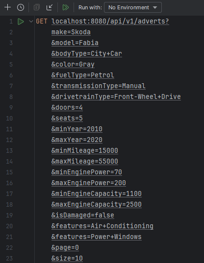
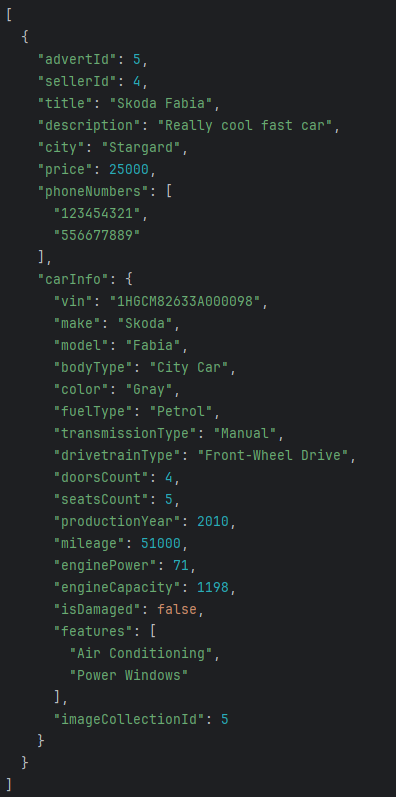
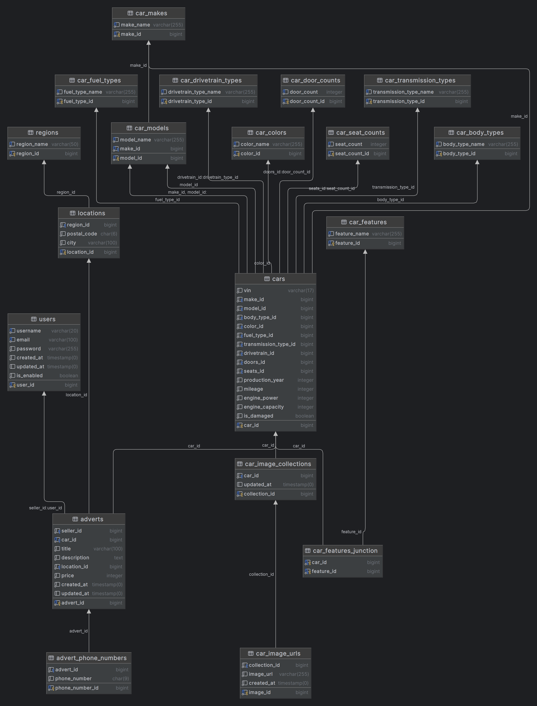

# StarMoto
Used car marketplace RESTful API made in Java Spring Boot. Users can add their adverts with images and search for existing ones.

# Tech stack
- Java
- Spring Boot
- Spring Security
- JWT
- Hibernate
- PostgreSQL
- Swagger

# How to add a new advert?
1. Create a new account using `/api/v1/auth/register` endpoint.
2. Retrieve your JWT token from `/api/v1/auth/authenticate` endpoint using your credentials from the previous step.
3. Send your advert in a json format using `/api/v1/adverts` endpoint attaching your JWT token in the header.

# How to add images to my advert?
Retrieve the advert ID from the advert POST request and use it to post a pictures of your car to `/api/v1/imageCollections/{your_adverts_id}/images` endpoint 

# How to delete images?
Send the image URL in a DELETE request to `/api/v1/image-collections/{your_adverts_id}/images` 

# How to update my advert?
Send a PUT request to this endpoint `/api/v1/adverts/{your_adverts_id}` 

# How to delete my advert?
Send a DELETE request to this endpoint `/api/v1/adverts/{your_adverts_id}` 

# How to retrieve adverts?
- Without filtering (newest) 
  Send a GET request to `/api/v1/adverts` with optional `page` and `size` parameters.

- With filtering 
  Send a GET request to `/api/v1/adverts` with optional parameters (and their dictionary GET endpoints):
  - make
  - model
  - bodyType
  - color
  - fuelType
  - transmissionType
  - drivetrainType
  - doors
  - seats
  - minYear
  - maxYear
  - minMileage
  - maxMileage
  - minEnginePower
  - maxEnginePower
  - minEngineCapacity
  - maxEngineCapacity
  - isDamaged
  - features
  - page
  - size
 
 Following attributes and their dictionary endpoints:
 
| Attribute          | Get endpoint                                  |
|--------------------|------------------------------------------------|
| make               | `/api/v1/car-references/makes`                |
| model              | `/api/v1/car-references/{make_name}/models`   |
| bodyType           | `/api/v1/car-references/body-types`           |
| color              | `/api/v1/car-references/colors`               |
| fuelType           | `/api/v1/car-references/fuel-types`           |
| transmissionType   | `/api/v1/car-references/transmission-types`   |
| drivetrainType     | `/api/v1/car-references/drivetrain-types`     |
| doors              | `/api/v1/car-references/door-counts`          |
| seats              | `/api/v1/car-references/seat-counts`          |
  
 <b>To receive adverts images send a GET request `/api/v1/image-collections/{advert_id}/images`</b>

# Swagger url and example requests with responses location

Swagger url: `/swagger-ui/index.html`

Example request are located at `/httpRequests`  and their responses at `/httpRequests/{requestType}/responses`

# Example GET adverts request with filtering

<b>Response</b>

# Database schema diagram

